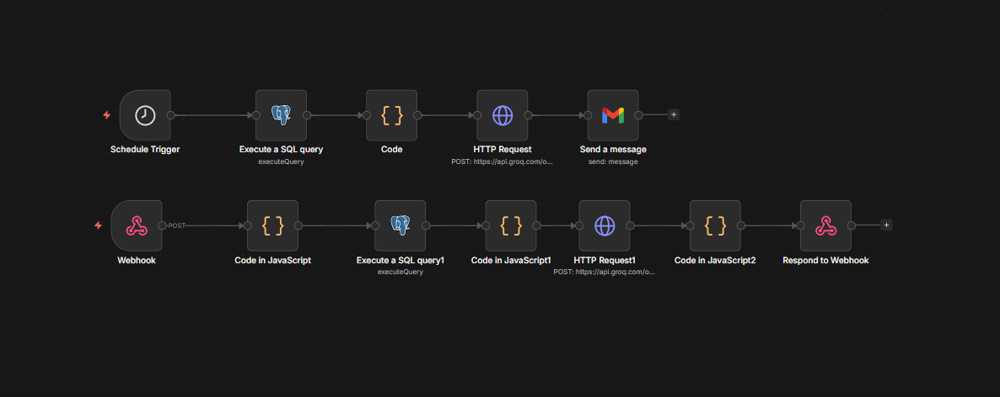

# Loan Portfolio Automations
 
An end-to-end automation solution that transforms raw loan data into actionable 
business intelligence using n8n workflow orchestration and Groq's LLaMA 3.3 70B.

---

## Problem Statement
Risk managers and leadership don't monitor dashboards daily. This project 
eliminates manual reporting by automating two core risk workflows — scheduled 
executive summaries and on-demand loan risk explanations.

---

## Workflows

### Workflow 1 — Automated Loan Portfolio Risk Summary
- Weekly Cron trigger initiates the pipeline automatically
- PostgreSQL fetches aggregated metrics — total loans, bad loan %, 
  high-risk grade distribution, avg interest rate
- LLM prompted as Chief Risk Officer to summarize exposure and flag 
  concerning trends in executive-ready language
- Output delivered via Email and Slack to the risk team

**Logic Flow:** `Cron → PostgreSQL → Code Node → LLM → Email/Slack`

### Workflow 2 — On-Demand Loan Explanation System
- Webhook receives natural language questions via POST request
- Supports specific queries (`"Why is id 34452715 risky?"`) and 
  general queries (`"Which borrower profiles are risky?"`)
- PostgreSQL fetches borrower details — grade, DTI, interest rate, 
  income category, employment length, purpose
- LLM prompted with interpretive and empathetic strategy to simplify 
  financial jargon and benchmark against a good loan profile
- Plain text explanation returned directly in the webhook response

**Logic Flow:** `Webhook → Code Node → PostgreSQL → Code Node → LLM → Response`

---

## Tech Stack
| Component | Tool |
|---|---|
| Workflow Orchestration | n8n |
| AI Model | LLaMA 3.3 70B via Groq |
| Database | PostgreSQL |
| Data Transformation | JavaScript (n8n Code Node) |
| API Integration | HTTP Request Node / Webhooks |
| Testing | Postman |

---

## Dataset
Cleaned and prepared loan dataset used for analysis.  
[Access Dataset](https://1drv.ms/x/c/a0b8f8951598bf90/IQAjbsZzCGG0R5jHp8PhJ7aDAR8MjPQIOit2hTa2l1JG5ZA?e=ee8QvE)

---

## Workflow Screenshots

### Workflow 1 — Risk Summary


### Workflow 2 — Loan Explanation


---

## How to Use

1. Import both JSON files into your n8n instance
2. Configure PostgreSQL credentials
3. Add your Groq API key in the HTTP Request node
4. For Workflow 1 — activate and let the Cron trigger run weekly
5. For Workflow 2 — send a POST request via Postman:

```json
{ "question": "Why is id 34452715 classified as bad debt?" }
```

---

## Key Insights
- **Automation:** 100% of manual report-writing eliminated for the risk department
- **Scalability:** HTTP Request nodes allow integration with any ERP or CRM system
- **Accuracy:** LLaMA 3.3 70B maintains contextual awareness of financial 
  nuances like DTI impact and grade-based risk segmentation
- **Transparency:** Borrowers and analysts get instant, plain-language 
  explanations without dashboard dependency

---

## Author
**Faisal Khan** — Data Analyst  
[GitHub](https://github.com/Faisal-Ghub)
